 # Rapport TP Machine learning
 
*CHAUVET Louis*
*GALLOO Augustin*

## Introduction

Dans cette série de TP nous allons mettre en pratique les connaissances acquises en apprentissage non-supervisé. L'objectif est de comparer différentes méthodes de clustering (k-means, clustering agglomératif et DB Scan Clustering). Ces méthodes seront appliquées sur plusieurs jeux de données en 2 dimensions. Dans une première partie, nous analyserons chaque méthode et dégagerons des points forts et faibles pour chacun d'entre elles. Enfin, dans une seconde partie nous fournirons des nouvelles données à chaque méthode et en tirerons une analyse comparative.

## Particularités des différentes méthodes de clustering

### Jeux de données

L'objectif de cette partie est d'analyser les algorithmes de clustering disponibles. Pour cela on a choisis différents jeux de données pour extraire des informations utiles sur les résultats. Les jeux de données choisies sont donc:

**x-clara**, un jeu de donnée qui montre trois groupes de données qui correspond à une vision "classique" d'un cluster: groupe de points dense et distincts;

**cassini**, là encore, un jeu de donnée qui montre aussi beaucoup de séparation entre les différents clusters. La particularité de celui ci c'est que les groupes ne sont pas très denses et pas forcément circulaires.

**3-spiral**, un jeu de donnée pour lequel la notion de cluster est plus complexe à identifier. Un oeuil humain voudrait grouper chaque branche de la spirale mais elles ne correspond plus à un groupe dense de point.

**birch-rg1**, un jeu de donnée qui ne représente aucun cluster, par contre il comporte un grand nombre de point, ce qui permettra de comparer les vitesse d'exécution des trois algorithmes.

## Méthodes d'évaluation

Pour évaluer la qualité de nos clusterings avec la méthode k-means, nous disposons de 3 métriques d'évaluation :

### Critère de Calinski-Harabasz

Ce critère est le ratio de la somme des dispersions entre les clusters et à l'intérieur des clusters et de la dispersion pour tous les clusters. On définit ici la dispersion comme la somme des distances au carré.

Plus ce critère est élevé, plus les clusters évalués sont bien définis.

### Critère de Davies-Bouldin

Ce critère représente la similarité moyenne entre clusters, où la similarité est une mesure qui compare la distance entre clusters avec la taille des clusters eux-mêmes.

Plus le score est bas, mieux les clusters sont séparés, le score minimum étant zéro.

### Silhouette Coefficient

Ce coefficient est compris entre +1 et -1 et se situe près de zéro s'il y a de "l'overlap" de clusters en assumant une définition "classique" du cluster (groupe de points).
Plus ce coefficient est élevé, mieux les clusters du modèle sont bien définis.

Désavantages :
Le coefficient de la silhouette is généralement plus élevé pour les clusters convexes que pour les autres concepts de clusters tels que les clusters basés sur la densité comme ceux obtenus via DBSCAN.

## K-Means

L'application de l'algorithme K-Means permet de regrouper les points ensemble par proximité directe. On peut constater
que pour le dataset xclara avec 3 cluster, le résultat est assez bluffant, les trois groupes sont bien identifiés !

Malheureusement cette méthode ne fonctionne pas correctement pour tous les datasets, par exemple avec le dataset cassini,
qui comporte 3 groupes mal identifiés :

Autre exemple de clusters mal identifiés pour 3-spiral :

Ci-dessous, voici une application de la méthode du "coude" pour les 3 jeux de données que nous avons décidé d'utiliser.

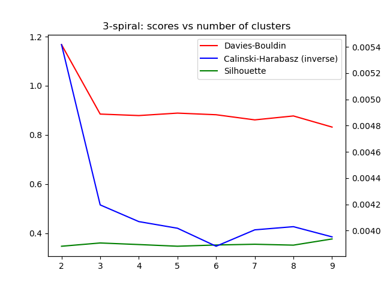

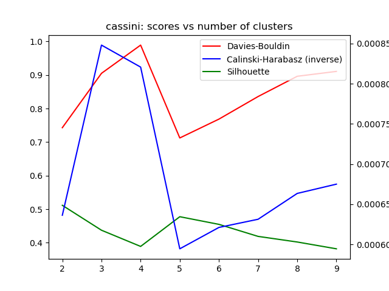

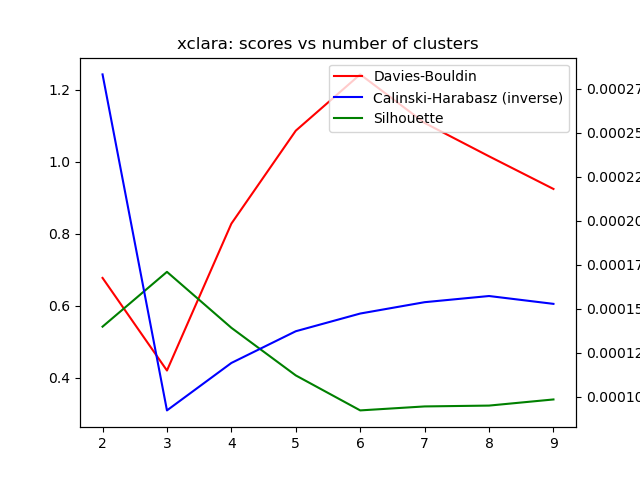

Nous avons également mesuré le temps de calcul pour chaque clustering :

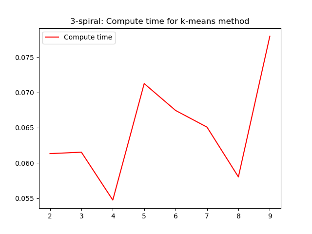

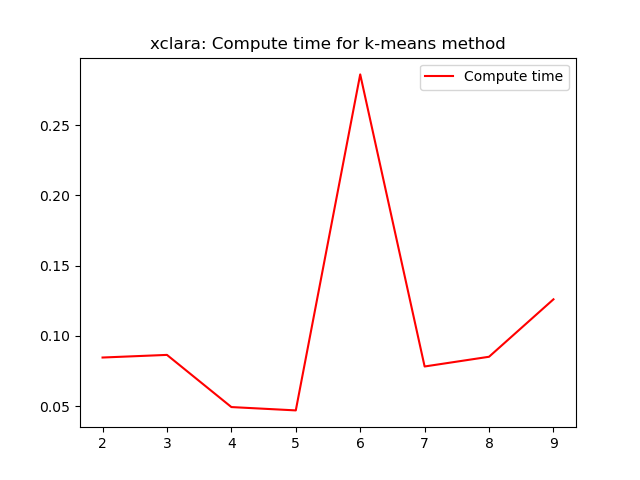

### Tableau récapitulatif

| Jeu de données | Nombre de clusters idéal | Temps calcul associé (s) |
|:---------------|:-------------------------|:-------------------------|
| 3-spiral       | 3                        | 0.062                    | 4                        |
| cassini        | 5                        | 0.058                    |
| xclara         | 3                        | 0.052                    |

### Limites de la méthode k-means                                                                        
La méthode K-means se base sur la distance moyenne des point. Il s'avère être efficace pour les clusters "cirulaires" tels que xclara. On observe une limite pour 

## Clustering agglomératif

Le clustering agglomératif consiste à regrouper les données en clusters en utilisant une stratégie hiérarchique. Les avantages de cette méthode sont sa capacité à générer des clusters de tailles et de formes variables. Cependant, il présente également des inconvénients tels que la sensibilité aux choix initiaux et la complexité de l'algorithme. De plus, la vitesse de calcul peut être un problème pour certains jeux de données volumineux.

Pour étudier cette méthode, nous utilisons la méthode AgglomerativeClustering de la bibiothèque scikit-learn. Nous faisons varier le paramètre *distance_threshold* qui représente la distance à partir de laquelle différents clusters ne seront plus fusionnés

Nous utilisons également le paramètre *linkage* qui va définir la méthode utiliser afin de calculer la distance entre les points. Nous pouvons utiliser les paramètres suivant :

- **ward** : minimise la variance des clusters fusionnés
- **average** : utilise la moyenne des distances de chaque observation de deux sets.
- **complete** : utilise la distance maximum entre toutes les observations de deux sets.
- **single** : utilise le minimum des distances entre toutes les observations de deux sets.

Nous choisissons premièrement d'utiliser le linkage 'average' pour le jeu de données *cassini* en faisant varier la distance du threshold :

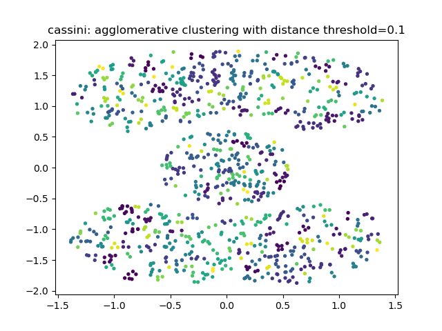

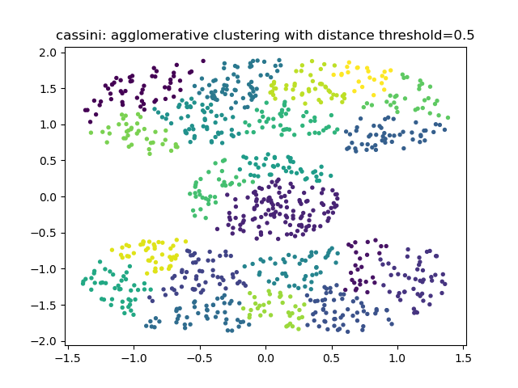

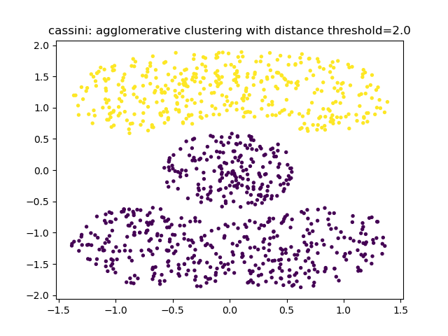

On comprend bien ici l'intêret de la méthode. Elle va venir classer chaque point de manière hiérarchique un par un en fonction de sa distance aux autres. On crée ici autant de clusters que nécessaires pour classer tous les points en respectant la distance fournie par le threshold. Ici, on voit bien les multiples clusters de cassini pour une faible distance, ce nombre de clusters tend à se réduire pour une grande distance.

Afin d'étudier ensuite l'impact de la méthode de linkage, nous mettons le paramètre threshold à None et changeons successivement le linkage, toujours pour cassini. Voici une représentation graphique de critères d'évaluation pour chaque paramètre de linkage possible :

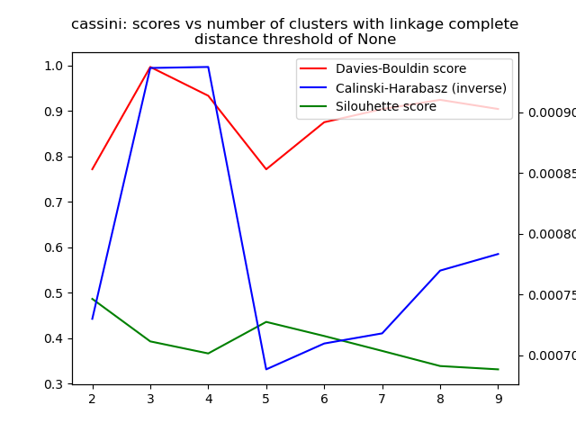

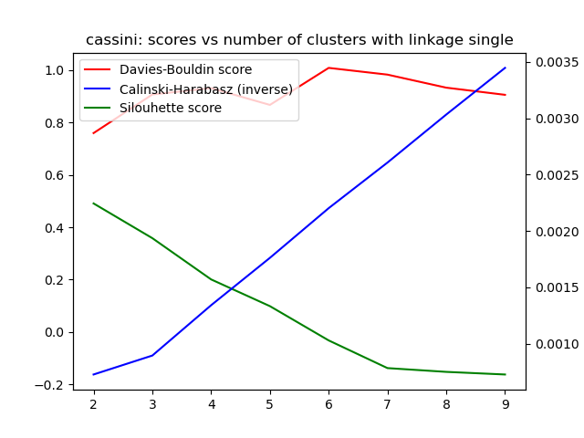

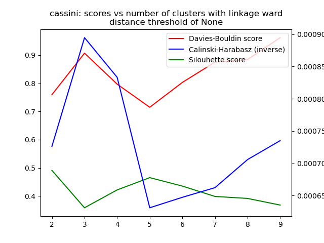

Voici un tableau récapitulatif de la méthode du coude pour les deux jeux de données :

| Jeu de données | Méthode de linkage | Nombre de clusters idéal | 
|:---------------|:-------------------|:-------------------------|
| 3-spiral       | average            | 6                        |  
| 3-spiral       | complete           | 4                        |
| 3-spiral       | single             | 7                        |
| 3-spiral       | ward               | 3                        |
| cassini        | average            | 3                        |  
| cassini        | complete           | 5                        |
| cassini        | single             | non-exploitable          |
| cassini        | ward               | 5                        |
| xclara         | average            | 3                        |  
| xclara         | complete           | 3                        |
| xclara         | single             | non-exploitable          |
| xclara         | ward               | 3                        |

Ce que nous pouvons tirer de ce tableau récapitulatif est que le jeu de données '3-spiral' n'est pas facilement clusterisable avec cette méthode, chaque paramètre de linkage nous fournit un nombre de clusters idéal différent. De plus, nous pouvons également relever que le paramètre 'single' n'est pas performant pour les sets donnés, et  ce, même pour 'xclara' qui est pourtant celui qui a été le mieux identifié par les autres paramètres de linkage.

## DBScan

La méthode DBscan permet de regrouper les points par densité. L'avantage de cette méthode c'est qu'elle regroupe les points en observant les points les plus proches tout en excluant les points isolés, le bruit. Avec un tel algorithme, on peut espérer que les 3 spirales soient bien identifiées.

Les deux paramètres principaux de cette méthode sont:
- *eps*: la distance maximale entre deux points pour qu'ils appartiennent au même groupe;
- *min_samples*: le nombre de point minimum pour considérer un groupe comme un groupe et pas du bruit.

L'avantage de cette méthode est qu'il n'est pas nécessaire de spécifier le nombre de groupe à trouver, l'algorithme arrivera à le trouver seul.

On peut constater ici que les groupes sont très bien identifiés sur les trois modèles:

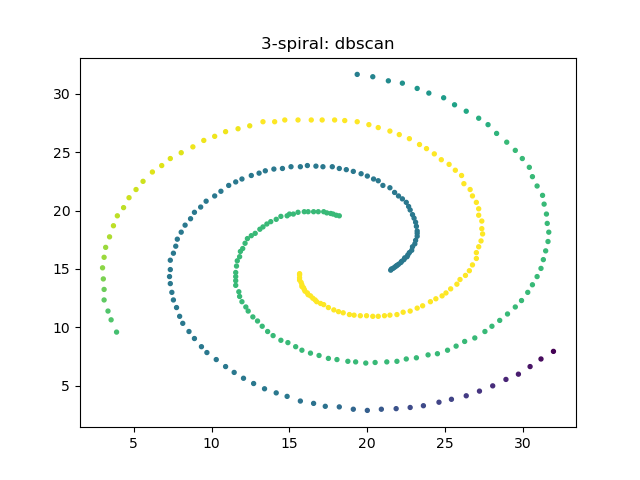

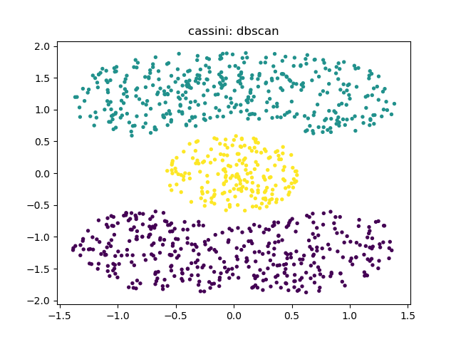

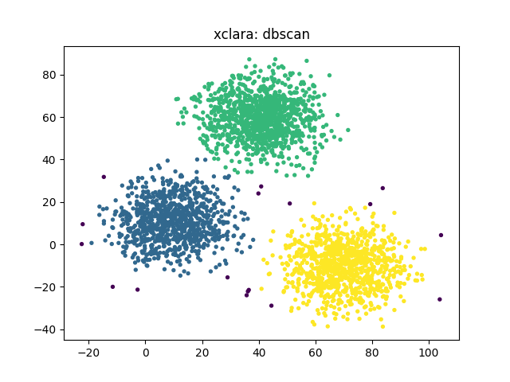

### Avantages

Les trois exemples ci-dessus permettent d'illustrer les principaux avantages de la méthode:
- Détection automatique du nombre de cluster à identifier, sur les trois modèles la méthode a bien identifié les 3 clusters;
- *3-spiral* montre qu'il est possible d'identifier des groupes peu dense et de manière plus "naturelle" contrairement aux autre méthodes;
- *xclara* montre que les points "isolés" sont bien considérés comme du bruit (violet sur l'image).

Cette méthode est celle qui a pu identifier le mieux les 3 modèles.

### Défauts

Pour obtenir la classification au dessus, il a fallu passer du temps pour définir les paramètres *eps* et *min_samples*. Il faut bien connaitre les données et étudier les regroupements voulus pour choisir les bonnes valeurs. Par exemple, si on compare xclara et cassini, xclara a des points aux coordonnées comprises entre -1.5 et 1.5 alors que xclara entre -20 et 100. Le paramètre *eps* change donc énormément entre ces deux modèles (0.2 pour cassini, 10 pour xclara).

La même réflexion peut être faite pour le nombre minimum de point pour considérer un cluster, c'est lui qui va permettre de ne pas confondre plusieurs points "bruits" agglomérés avec un cluster standard. 

Cet algorithme est également peu adapté lorsque les groupes ne sont distincts et 

Les défauts de la méthode DBSCAN incluent:

    Elle est sensible aux paramètres eps et minPts, qui doivent être choisis avec soin pour obtenir des résultats satisfaisants.
    Elle peut avoir des difficultés à gérer les densités de densité variable.
    Il peut être difficile de déterminer la distance appropriée à utiliser pour définir les groupes.
    Il peut être inadapté pour des données en grande dimension ou des données à haute densité
    Il est gourmand en ressources pour de grandes quantités de données.

# Partie 2 - Nouvelles données

## K-Means

Pour K-Means on peut constater sur les différents modèles que la méthode groupe les nouveau points en fonction de la proximité avec les clusters existants. On comprend donc bien que la clusterisation de la spirale n'est pas possible avec cette méthode.

Pour les jeux cassini et xclara le regroupement se fait assez bien. On constate magré tout que la séparation sur xclara n'est pas très claire au niveau du cluster en abs à droite. Cela peut être du à la densité du cluster qui est plus éloigné.

Pour cassini on retrouve exactement le découpage du plan et on peut constater que le groupe de points central n'est pas bien identifié.

Pour 3-spiral on constate là aussi que le découpage proposé n'est pas du tout en adéquation avec les points. Cette méthode ne peut donc pas s'appliquer

## Agglomerative clustering et DBScan

Il n'est pas possible de faire la même chose pour DBScan et agglomerative clustering car ce sont des algorithmes de classification et pas de prédiction. Le même graphique que pour K-Means n'a pas de sens et fausserait complètement tous les résultats.

