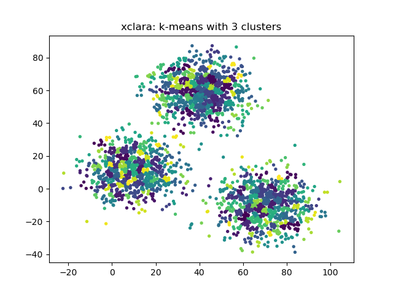

 # Rapport

## Jeu de données

Pour ce TP, nous utilisons des jeux de données artificiels que nous lisons avec le package *arff* de *scipy.io*

    import warnings
    
    import numpy as np
    import matplotlib.pyplot as plt
    from scipy.io import arff
    from sklearn import cluster, metrics
    from time import time
    print()
    warnings.filterwarnings("ignore")
    
    path = './clustering-benchmark/src/main/resources/datasets/artificial/'
    
    
    def load_data(dataset: str) -> np.ndarray:
        databrut = arff.loadarff(open(path + dataset + ".arff", 'r'))
        return np.array([[x[0], x[1]] for x in databrut[0]])

## Méthode d'évaluation

Pour évaluer la qualité de nos clusterings avec la méthode k-means, nous disposons de 3 métriques d'évaluation :

### Critère de Calinski-Harabasz
Ce critère est le ratio de la somme des dispersions entre les clusters et à l'intérieur des clusters et de la dispersion pour tous les clusters. On définit ici la dispersion comme la somme des distances au carré.

Plus ce critère est élevé, plus les clusters évalués sont bien définis.

### Critère de Davies-Bouldin

Ce critère représente la similarité moyenne entre clusters, où la similarité est une mesure qui compare la distance entre clusters avec la taille des clusters eux-mêmes.

Plus le score est bas, mieux les clusters sont séparés, le score minimum étant zéro.

### Silhouette Coefficient

Ce coefficient est compris entre +1 et -1 et se situe près de zéro s'il y a de "l'overlap" de clusters en assumant une définition "classique" du cluster (groupe de points).
Plus ce coefficient est élevé, mieux les clusters du modèle sont bien définis.

Désavantages :
Le coefficient de la silhouette is généralement plus élevé pour les clusters convexes que pour les autres concepts de clusters tels que les clusters basés sur la densité comme ceux obtenus via DBSCAN.

## K-Means

L'application de l'algorithme K-Means permet de regrouper les points ensemble par proximité directe. On peut constater
que pour le dataset xclara avec 3 cluster, le résultat est assez bluffant, les trois groupes sont bien identifiés !

Malheureusement cette méthode ne fonctionne pas correctement pour tous les datasets, par exemple avec le dataset cassini,
qui comporte 3 groupes mal identifiés :

Appliquez itérativement la méthode précédente pour déterminer le bon nombre de clusters à l’aide de métriques d’évaluation 
- Mesurez le temps de calcul
- Arrivez-vous à retrouver le résultat attendu à l’aide de ces métriques d’évaluation ?

Ci-dessous, voici une application de la méthode du "coude" pour les 4 jeux de données que nous avons décidé d'utiliser.

Tableau récapitulatif

| Jeu de données | Nombre de clusters idéal |
|:---------------|:-------------------------|
| 3-spiral       |  3                       |
| birch-rg1      | 4                        |
| cassini        | 5                        |
| xclara         | 3                        |

## Limites de la méthode k-means                                                                                                                                                                                                                                                                                                                                                                                                                                                                                                               

# Clustering agglomératif

Choisissez quelques (2 ou 3) jeux de données pour lesquels il vous semble que la méthode de
clustering aggomératif devrait identifier correctement les clusters.
• Appliquez itérativement la méthode de clustering agglomératif en faisant varier le seuil de dis-
tance afin de déterminer une bonne solution de clustering à l’aide des métriques d’évaluation
– Considérez différentes manières de combiner des clusters (single, average, complete, ward
linkage), uniquement pour la distance euclidienne. Par défaut l’option connectivity est
laissée à none.
– Mesurez le temps de calcul
– Arrivez-vous à retrouver le résultat attendu à l’aide de ces critères d’évaluation ?
• Avez-vous automatisé votre code ? Recommencez en faisant varier le nombre de clusters
3.3 Limites de la méthode
Choisissez quelques (2 ou 3) jeux de données pour lesquels il vous semble que la méthode de
clustering agglométarif aura des difficultés pour identifier correctement les clusters.
Appliquez la méthode de clustering agglomératif sur ces jeux de données pour confirmer vos choix.

